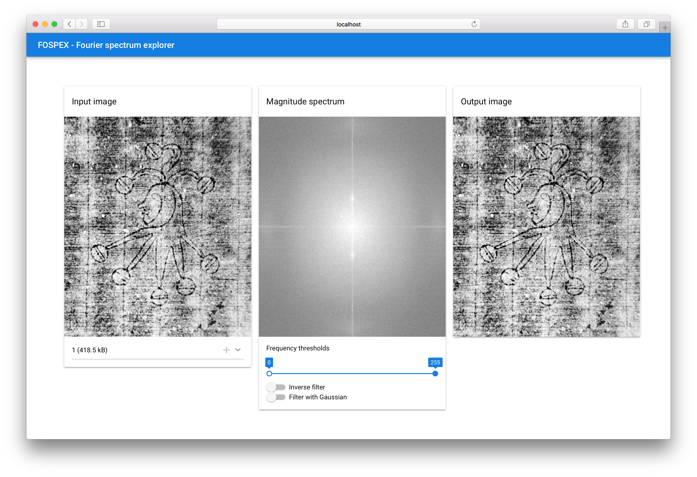

# FOSPEX - Fourier Spectrum Explorer
An interactive application to explore the fourier spectrum of an image and find possible notch filters.



Used core frameworks and libraries:

- Frontend: NPM, Vue.js, Quasar
- Backend: FLASK

## Frontend

To run frontend, enter
```bash
cd frontend
quasar dev
```

## Backend

Make sure you have installed all requirements: 

```bash
cd backend
pip install -r requirements.txt
```

To run the backend, enter
```bash
FLASK_APP=main.py flask run
```